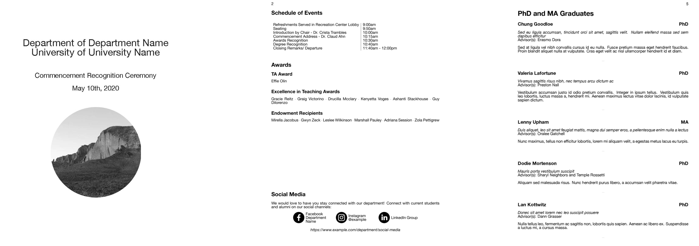

# auto-graduation

This is my take on a commencement program. This was designed to replace a seriously antiquated Microsoft Word 2003 template with all the clip art fixings you can imagine.

Each year our department staff copied and pasted students and faculty into a word file. There used to be an assembly line of staff to fold and staple about one thousand graduation programs. It was easily the most frustrating thing I've ever seen in my entire life so I made this LaTeX template.

Each year we send a survey to our undergraduate and graduate students to see if they plan to attend graduation and how many guests they plan to bring with them. We also ask their preferred name and if they have any future plans or thanks to share on graduation day. We use the data from this survey to create our yearly graduation commencement program.

## Requirements and Setup

**Survey Collection:**
We collect our student responses using Qualtrics each year. Qualtrics allows you to pool emails together and send a survey to a dynamic list of email addresses. Students are reminded weekly to fill out the survey until a deadline.

**LaTeX editor:**
Visit [The LaTeX Project](https://www.latex-project.org/get/) for platform specific versions of LaTeX. LaTeX can also be compiled using a text editor like [Atom](https://atom.io/)

**Students or sample data:** This template is pretty specific to a higher education graduation program but feel free to fork the code and improve upon my novice attempt at making a LaTeX template.

### Structure

How is this thing organized? There are two folders and two latex documents. The /assets directory is where I've opted to store images and logo assets.
The /data directors is for .csv lists and other data files. Obviously it doesn't matter how things are setup, I just like a little organization.

### Notes on CSV Reader

The [csvsimple](https://osl.ugr.es/CTAN/macros/latex/contrib/csvsimple/csvsimple.pdf) package is awesome but I'm using it a way that I'm sure the author did not intend. When students reply with full sentences, "&" and "#" symbols, csvsimple likes to pout and tell you something's wrong. Usually it's pretty good at telling you what that is but I've certainly had moments where I had no clue what sort of crazy error some plain text had caused.

### General Instructions

If you plan to poll student data, get ready to learn a few MS Excel formulas, basic text editing is key to making the .csv files play nicely with csvsimple.

1. Gather data
2. Compare demo data to your data, duplicate demo data .csv and use Excel or a text editor to copy data into the .csv file.
    * MS Excel will format things incorrectly but cleanup should be simple.
    * look for "#", "&" or "" marks in the .csv files, you can "escape" # and & with the "\" backslash mark: i.e. "...Thanks mom & dad for..." might produce an error but "...Thanks mom \& dad for..." is going to compile real nice.
    * Encapsulate large sentences with {} curly brackets to allow for quotes and commas to be interpreted literally and not as special characters.
3. Build and test. Does everything compile? Are there errors in the code?
4. Grab coffee and enjoy life for a moment while your co-workers never have to fold and staple one thousand sheets of paper.

## Printing

### Building Portrait

When you've designed a working copy of the program and you are prepared to print, compile the LaTeX document using any compiler of your choosing. The .pdf should then be converted into a booklet format using the "Booklet Format-letter.tex" program.

### Building into Booklet Format

The final step of compiling this program as a booklet is to let LaTeX recompile the pages from the portrait copy as a booklet format. This template uses the [pdfpages](http://texdoc.net/texmf-dist/doc/latex/pdfpages/pdfpages.pdf) package to do this.

Building a PDF from the booklet format .tex file should produce a nice booklet style file to send to a print shop.  

#### Last Thoughts

I've used this as a learning project, any thoughts or comments on formatting are welcomed.
